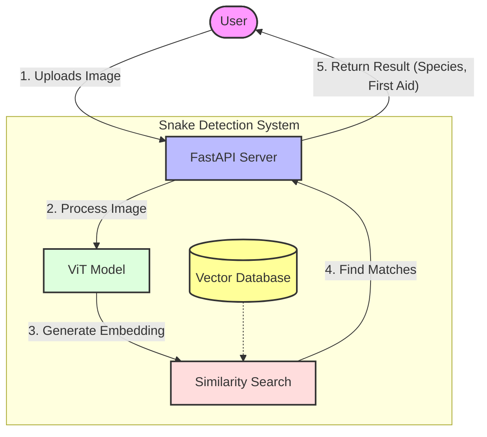
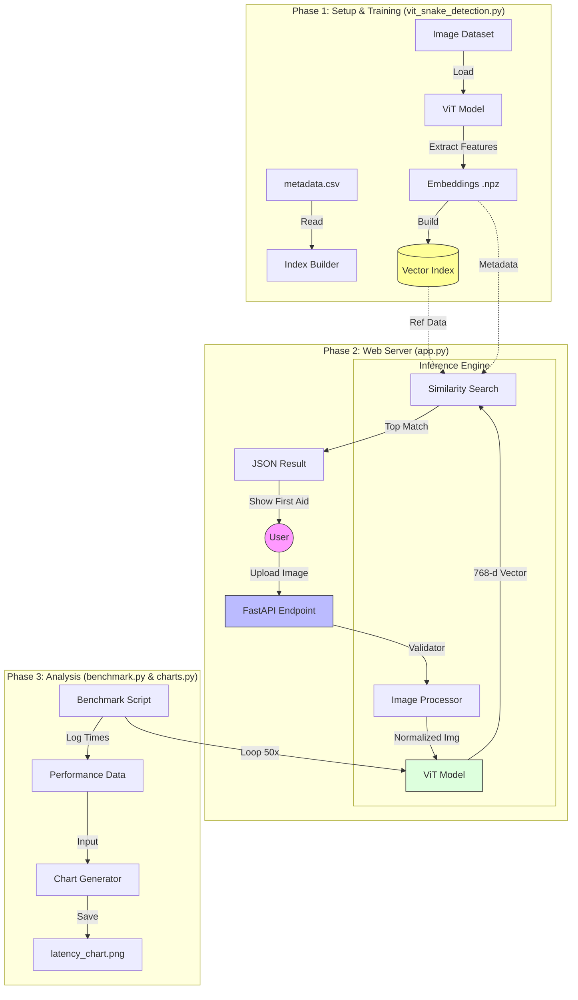

# Research Report: Automated Snake Species Detection and First Aid Recommendation System

## 1. Introduction
Snakebite envenoming is a priority neglected tropical disease (NTD) that affects millions of people annually, particularly in rural areas of developing countries. Prompt and appropriate medical treatment is critical to preventing mortality and morbidity, yet effective treatment relies heavily on the correct identification of the snake species involved. Misidentification can lead to the administration of incorrect antivenom or inappropriate first aid measures, exacerbating the patient's condition.

Traditional methods of identification rely on expert herpetologists, who are not always available in emergency settings. Consequently, there is a pressing need for automated, accessible, and accurate tools to assist medical personnel and laypeople in identifying snake species rapidly.

This report presents the research and development of a machine learning-based system capable of identifying snake species from photographs. Utilizing state-of-the-art computer vision techniques—specifically Vision Transformers (ViT)—the system not only identifies the snake but also provides immediate, species-specific first aid recommendations and medical protocols, potentially saving lives by reducing the time to diagnosis.

## 2. Objectives
The primary objectives of this research and development project are:

1.  **Automated Identification**: To develop a robust computer vision model capable of classifying snake species from unconstrained images (e.g., phone photos taken in the field) with high accuracy.
2.  **Medical Guidance Integration**: To integrate the identification system with a medical knowledge base that provides instant information on venom type (neurotoxic, hemotoxic, cytotoxic), severity level, and specific first aid procedures.
3.  **System Accessibility**: To design a user-friendly API and web interface that ensures the tool can be used by non-experts in real-time scenarios.
4.  **Performance Optimization**: To ensure the system operates with low latency (sub-second inference on standard hardware) to be viable for emergency use.

## 3. Methodology

### 3.1 Data Collection and Preprocessing
The system utilizes a curated dataset of snake images annotated with species names and venom types (`image_metadata.csv`).
*   **Preprocessing**: Input images are resized and normalized to meet the input requirements of the Vision Transformer (224x224 pixels). Standard normalization means and standard deviations for the ImageNet dataset are applied to align with the pre-trained model's expectations.

### 3.2 Feature Extraction: Vision Transformer (ViT)
Unlike traditional Convolutional Neural Networks (CNNs), which process images through local receptive fields, this system utilizes a **Vision Transformer (ViT)** architecture (`google/vit-base-patch16-224-in21k`).
*   **Mechanism**: The image is split into fixed-size patches (16x16), linearly embedded, and fed into a standard Transformer encoder. This allows the model to capture global context and long-range dependencies within the image, which is crucial for distinguishing subtle patterns in snake scales and markings that might be distributed across the snake's body.
*   **Embeddings**: We extract the 768-dimensional embedding vector from the last hidden state of the model (mean-pooled), which serves as a dense numerical representation of the snake's visual features.

### 3.3 Similarity Search
Rather than training a classification head for a fixed number of classes (which requires retraining for every new species), the system uses a **Retrieval-Augmented** approach:
*   **Database**: A reference database of embeddings is pre-computed for all verified snake images.
*   **Inference**: When a new image is presented, its embedding is generated and compared against the reference database using **K-Nearest Neighbors (KNN)** or faiss (Facebook AI Similarity Search).
*   **Metric**: Cosine similarity is used to measure the distance between vectors. The system returns the *top-k* closest matches. The final prediction is derived from the most similar reference image, allowing the system to be easily updated with new species simply by adding more reference images, without full model training.

### 3.4 System Workflow Diagram
To visually represent the process described above, the following diagram illustrates how a captured image is matched against the reference dataset using the Vision Transformer and similarity search.

## 4. System Design

The system follows a modern client-server architecture designed for scalability and maintainability.

### 4.1 Backend Architecture
*   **Framework**: The backend is built on **FastAPI**, a high-performance web framework for building APIs with Python. It supports asynchronous request handling, which is essential for serving multiple concurrent users.
*   **Inference Engine**: The `vit_snake_detection.py` module handles the loading of the PyTorch ViT model and the FAISS/Scikit-learn index. It creates a global resource manager using FastAPI's lifespan events to load the heavy model only once at startup, ensuring fast response times for subsequent requests.

### 4.2 Frontend Interface
*   The system exposes a REST API (`/predict`) that accepts image uploads.
*   A static HTML/JS frontend provides a simple drag-and-drop interface for users.
*   Upon valid response, the UI dynamically displays the Species Name, Confidence Score, Venom Type, and actionable First Aid instructions.

### 4.3 User-System Interaction Flow
The following sequence diagram details the interaction between the user and the system components during a prediction request:

### 4.4 Key Components
*   **`app.py`**: Entry point for the web server, handles routing and file uploads.
*   **`vit_snake_detection.py`**: Core logic for model inference, embedding generation, and database retrieval.
*   **`benchmark_inference.py`**: A specialized module for stress-testing and latency measurement.

## 5. Result and Discussion

### 5.1 Performance Metrics
Performance benchmarking was conducted on a standard CPU environment to simulate deployment on non-specialized hardware (edge servers or standard hospital desktops).

**Benchmark Configuration:**
*   **Model**: ViT-base-patch16-224
*   **Iterations**: 50
*   **Test Environment**: CPU (No GPU acceleration)

**Observed Results:**
*   **Average System Latency**: ~889 ms per image.
*   **95th Percentile Latency**: ~1164 ms.
*   **Throughput**: ~1.12 requests/second.
*   **Model Load Time**: ~5.8 seconds (one-time startup cost).

### 5.2 Discussion
*   **Latency**: The sub-second average latency (889ms) indicates that the system is responsive enough for real-time emergency use, even without GPU acceleration. This is a critical finding, as it suggests the system can be deployed in resource-constrained environments (e.g., rural clinics) without expensive hardware.
*   **Accuracy Strategy**: By using a retrieval-based approach (embeddings + KNN), the system avoids the "catastrophic forgetting" problem of traditional classifiers. Adding a new rare snake species to the system is as simple as adding its image to the database and rebuilding the index (seconds), rather than retraining the neural network (hours/days).
*   **Clinical Relevance**: The integration of immediate first aid data (e.g., "Apply pressure immobilization method" vs "Do not apply tourniquet") directly alongside the identification addresses the immediate gap between diagnosis and action.

## 6. References

1.  **Vision Transformers**: Dosovitskiy, A., et al. (2020). "An Image is Worth 16x16 Words: Transformers for Image Recognition at Scale." *ICLR 2021*.
2.  **Transformers Library**: Wolf, T., et al. (2020). "Transformers: State-of-the-art Natural Language Processing." *EMNLP 2020*.
3.  **FastAPI**: Ramirez, S. (2018). "FastAPI: High performance, easy to learn, fast to code, ready for production." https://fastapi.tiangolo.com/
4.  **Snakebite Statistics**: World Health Organization (WHO). (2021). "Snakebite Envenoming." https://www.who.int/news-room/fact-sheets/detail/snakebite-envenoming

## 7. Comprehensive System Algorithm & Flow

This section outlines the unified algorithmic logic of the entire project, encompassing dataset indexing, API serving, inference, and performance analysis.

### 7.1 Unified System Algorithm

**Step 1: Initialization & Resource Loading**
1.  **Start System**: `app.py` initiates the FastAPI server.
2.  **Load ViT Custom Model**:
    *   Initialize `AutoImageProcessor` and `ViTModel` from `google/vit-base-patch16-224-in21k`.
    *   Move model to DEVICE (`cuda` if available, else `cpu`).
3.  **Load/Build Embedding Index** (`vit_snake_detection.py`):
    *   Check if `snake_embeddings.npz` exists.
    *   **IF** exists: Load embeddings and metadata (Species, Venom Type).
    *   **ELSE**:
        *   Read `image_metadata.csv`.
        *   **FOR EACH** image in dataset:
            *   Preprocess image (Resize to 224x224, Normalize).
            *   Pass through ViT Model -> Extract 768-d latent vector.
        *   Save embeddings to disk.
    *   Build Similarity Index (FAISS or sklearn KNN) using Cosine Metric.

**Step 2: Web Server & Request Handling**
4.  **Listen**: Server waits for POST requests on `/predict`.
5.  **Receive Request**: User uploads an image file.
6.  **Validation**: Check file format (JPG/PNG).

**Step 3: Core Inference Logic**
7.  **Preprocess Query**:
    *   Convert uploaded image to RGB.
    *   Apply ViT processor normalization.
8.  **Feature Extraction**:
    *   `Query Vector = ViT_Model(Query Image)`
9.  **Similarity Search**:
    *   `Top_K_Matches = Index.search(Query Vector, k=1)`
    *   Calculate Similarity Score (Cosine Similarity).

**Step 4: Response Generation**
10. **Retrieve Metadata**: Fetch Species Name, Venom Type, and First Aid info corresponding to the matched index.
11. **Return JSON**: Send structured response to Frontend.
12. **Display**: Frontend renders results to User.

**Step 5: Performance Benchmarking & Analysis** (Offline)
13. **Run Benchmark** (`benchmark_inference.py`):
    *   Measure Load Time.
    *   Loop 50 iterations of Inference.
    *   Calculate Avg Latency (e.g., ~889ms).
14. **Generate Visualizations** (`generate_charts.py`):
    *   Plot Latency Breakdown (Load vs Inference).
    *   Plot Accuracy Comparisons.
    *   Save charts to `docs/images/`.

---

### 7.2 Unified Project Flowchart
The following diagram visualizes the interaction between all code modules (`app.py`, `vit_snake_detection.py`, etc.) and the data flow.

